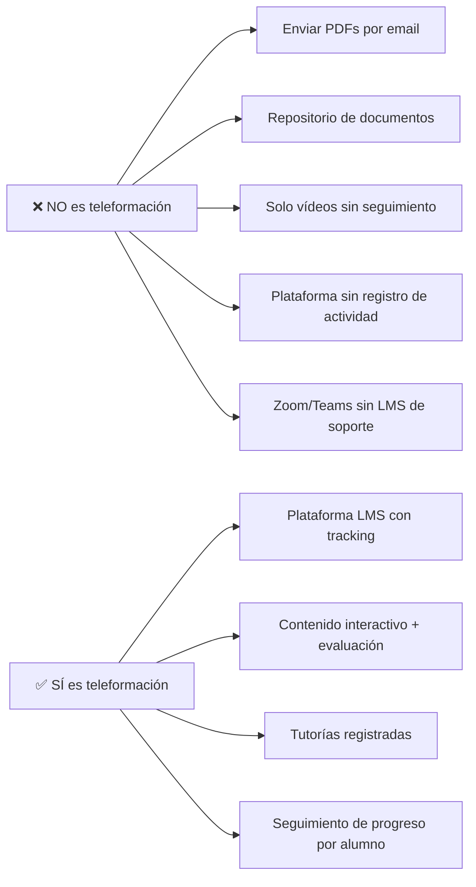
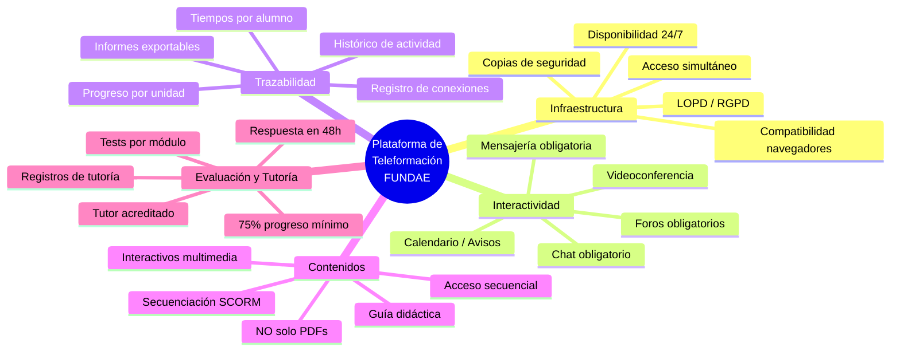
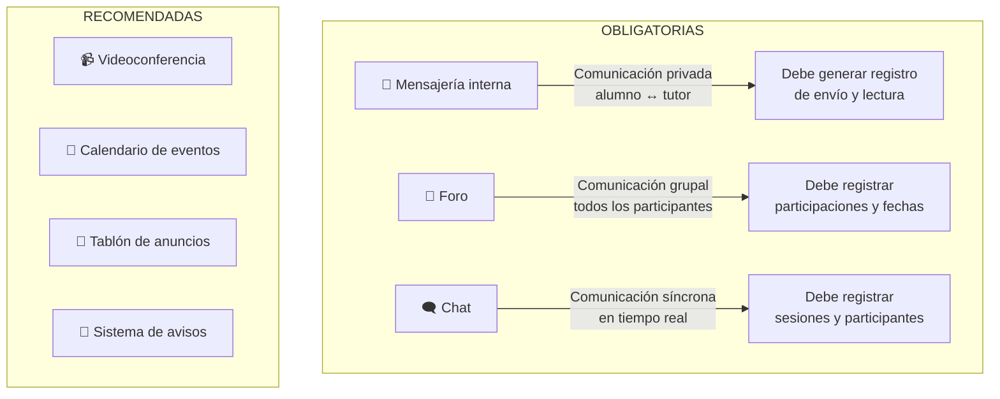
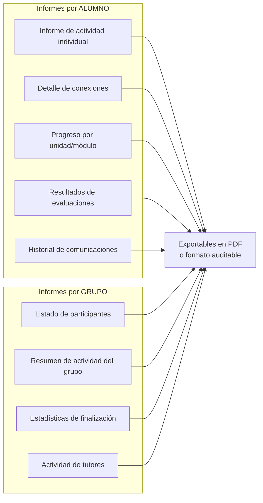
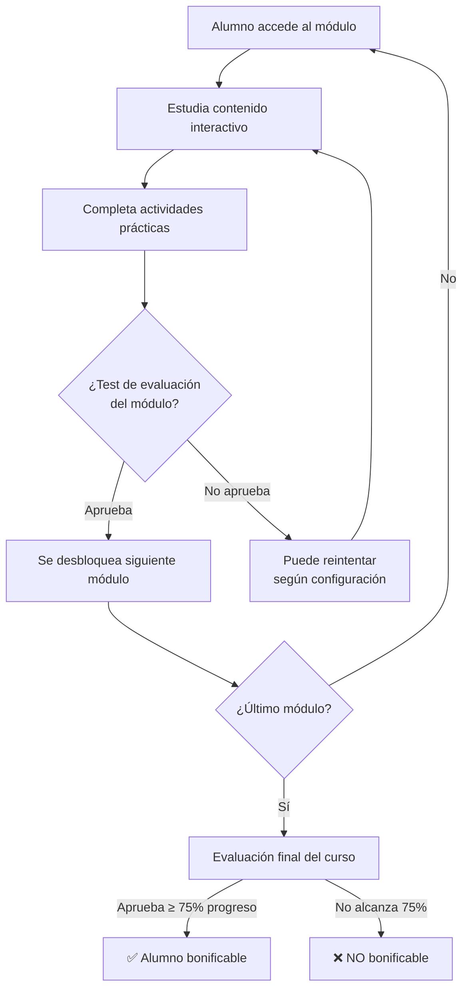
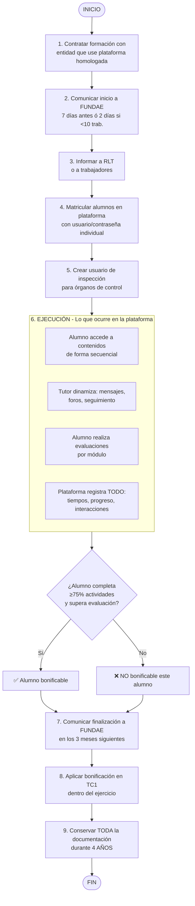

---

# Requisitos Técnicos de la Plataforma de Teleformación para FUNDAE

> Versión: v2026.1 · Actualizado: Marzo 2026
> Guía elaborada por [CiberAula](https://www.ciberaula.com) · Más de 20 años operando plataformas Moodle homologadas para FUNDAE

**Esta es la guía más detallada y práctica sobre los requisitos que FUNDAE exige a las plataformas de teleformación.** No es una copia de la normativa: es una interpretación operativa basada en nuestra experiencia diaria gestionando formación bonificada en modalidad online y en las conclusiones de auditorías reales.

---

## Índice

1. [¿Qué entiende FUNDAE por teleformación?](#1-qué-entiende-fundae-por-teleformación)
2. [Marco normativo](#2-marco-normativo)
3. [Mapa de requisitos](#3-mapa-de-requisitos)
4. [Requisitos de infraestructura](#4-requisitos-de-infraestructura)
5. [Requisitos de interactividad y comunicación](#5-requisitos-de-interactividad-y-comunicación)
6. [Requisitos de trazabilidad y registros](#6-requisitos-de-trazabilidad-y-registros)
7. [Requisitos de contenidos](#7-requisitos-de-contenidos)
8. [Requisitos de evaluación](#8-requisitos-de-evaluación)
9. [Requisitos de tutorización](#9-requisitos-de-tutorización)
10. [Acceso para órganos de control](#10-acceso-para-órganos-de-control)
11. [Accesibilidad y protección de datos](#11-accesibilidad-y-protección-de-datos)
12. [Diagrama del flujo de una acción formativa en teleformación](#12-diagrama-del-flujo-de-una-acción-formativa-en-teleformación)
13. [Checklist de verificación rápida](#13-checklist-de-verificación-rápida)
14. [Errores que provocan devolución en auditoría](#14-errores-que-provocan-devolución-en-auditoría)
15. [Recursos oficiales y videotutoriales](#15-recursos-oficiales-y-videotutoriales)

---

## 1. ¿Qué entiende FUNDAE por teleformación?

FUNDAE define la teleformación como:

> *"Modalidad de impartición que se desarrolla a través de una plataforma virtual de aprendizaje que posibilite la interactividad de alumnos, tutores y recursos situados en distinto lugar y que asegure la gestión de los contenidos, un proceso de aprendizaje sistematizado para los participantes, su seguimiento continuo y en tiempo real, así como la evaluación de todo el proceso."*
> — Art. 4.2 del Real Decreto 694/2017

### Lo que NO es teleformación según FUNDAE

**Punto clave:** La mera puesta a disposición de contenidos NO es teleformación. FUNDAE exige que haya interacción, seguimiento y evaluación demostrable.

---

## 2. Marco normativo

| Norma | Contenido relevante |
|-------|-------------------|
| **Ley 30/2015**, de 9 de septiembre | Ley del Sistema de Formación Profesional para el Empleo |
| **RD 694/2017**, de 3 de julio | Desarrolla la Ley 30/2015. Art. 4 define requisitos de teleformación |
| **Orden TMS/368/2019**, de 28 de marzo | Regula la formación de oferta y aspectos comunes |
| **Resoluciones SEPE** (actualizaciones anuales) | Detalles operativos, inclusión de aula virtual |
| **Documento de orientaciones FUNDAE** | Guía práctica de requisitos (retirado en 2022, pero sigue siendo referencia) |

> 📹 **Videotutorial oficial de FUNDAE**: [Videotutoriales de formación programada](https://www.fundae.es/atencionusuario/videotutoriales) — Incluye vídeos sobre crédito de formación, alta de empresa, acciones formativas, comunicación de inicio y finalización.

---

## 3. Mapa de requisitos

Los requisitos de FUNDAE para plataformas de teleformación se organizan en 5 áreas principales:

---

## 4. Requisitos de infraestructura

### 4.1 Disponibilidad

La plataforma debe estar operativa **24 horas al día, 7 días a la semana** durante todo el período de la acción formativa. No son admisibles paradas de mantenimiento durante horarios en los que los alumnos puedan necesitar acceso.

### 4.2 Acceso simultáneo

Debe soportar el acceso simultáneo de **todos los participantes matriculados** sin degradación del servicio. Esto implica dimensionar correctamente el servidor:

| Participantes simultáneos | Requisitos orientativos del servidor |
|--------------------------|-------------------------------------|
| Hasta 50 | Servidor compartido potente o VPS básico |
| 50-200 | VPS dedicado o servidor cloud escalable |
| 200-500 | Servidor dedicado o infraestructura cloud |
| 500+ | Infraestructura cloud con autoescalado |

### 4.3 Compatibilidad

- Acceso desde **cualquier navegador moderno** (Chrome, Firefox, Edge, Safari)
- Diseño responsive o compatible con dispositivos móviles
- No requerir instalación de plugins propietarios

### 4.4 Seguridad y copias de seguridad

- **Autenticación individual**: Cada alumno accede con usuario y contraseña únicos
- **Copias de seguridad** con periodicidad suficiente para recuperar todos los datos
- **Ubicación del servidor**: Debe identificarse la ubicación física. Si está fuera de la UE, debe cumplir las normas de transferencias internacionales de datos
- **Cifrado**: Recomendable HTTPS (certificado SSL) para todo el tráfico

### 4.5 Protección de datos

- Cumplimiento de **RGPD** (Reglamento UE 2016/679)
- Cumplimiento de **LOPDGDD** (Ley Orgánica 3/2018)
- Identificar al responsable del tratamiento de datos
- Informar a los alumnos del tratamiento de sus datos en la plataforma

---

## 5. Requisitos de interactividad y comunicación

FUNDAE exige que la plataforma disponga de herramientas de comunicación **síncronas** (en tiempo real) y **asíncronas** (diferidas):

### Herramientas obligatorias

### Lo que verifican en auditoría

Los auditores de FUNDAE comprueban que:

1. Las herramientas de comunicación **existen** en la plataforma
2. **Se han utilizado realmente** durante la formación (hay registros de actividad)
3. El tutor ha respondido a las consultas en un **plazo razonable** (máximo 48 horas laborables)
4. Hay evidencia de **interacción bidireccional** (no solo el tutor publicando, también los alumnos participando)

> ⚠️ **Error real en auditoría**: Tener foros y chat habilitados pero vacíos. FUNDAE interpreta que no hubo tutorización real. Asegúrate de que el tutor inicia conversaciones, plantea preguntas y responde activamente.

---

## 6. Requisitos de trazabilidad y registros

Este es el área más crítica. La plataforma debe generar y conservar **registros detallados** de toda la actividad formativa.

### 6.1 Registros obligatorios por alumno

| Registro | Qué debe contener | Para qué se usa |
|----------|-------------------|-----------------|
| **Alta de usuario** | Fecha/hora de matriculación, datos del alumno | Verificar que el alumno estaba dado de alta antes del inicio |
| **Conexiones** | Fecha, hora de inicio, hora de fin, IP | Demostrar que el alumno accedió a la plataforma |
| **Tiempo de conexión** | Tiempo total y por sesión | Verificar coherencia con las horas del curso |
| **Progreso** | % completado, unidades visitadas, orden de acceso | Demostrar que completó al menos el 75% del contenido |
| **Evaluaciones** | Intentos, respuestas, calificaciones, fecha/hora | Acreditar que se realizaron los controles de aprendizaje |
| **Interacciones** | Mensajes, foros, chats con fecha/hora | Demostrar tutorización efectiva |

### 6.2 Informes que debe generar la plataforma

### 6.3 Tiempo de conexión

FUNDAE no establece un tiempo mínimo obligatorio de conexión. Sin embargo:

- El tiempo debe ser **coherente** con la duración del curso
- Si un curso de 60 horas muestra tiempos de conexión de 5 horas por alumno, se considerará fraude
- Como referencia práctica: el tiempo de conexión debería ser al menos un **50-60% de las horas totales** del curso (el resto puede ser trabajo offline con materiales descargados)

> 💡 **Consejo de experiencia**: Configura en tu LMS un tiempo mínimo por actividad. Si una lección está diseñada para 2 horas, que el sistema no la marque como completada en menos de 40-60 minutos. Esto protege a la empresa ante auditorías.

---

## 7. Requisitos de contenidos

### 7.1 Formato y calidad

Los contenidos deben ser:

| Requisito | Correcto ✅ | Incorrecto ❌ |
|-----------|------------|--------------|
| **Interactivos** | HTML5 con vídeos, animaciones, actividades integradas | PDF estáticos subidos a la plataforma |
| **Multimedia** | Texto + imágenes + vídeo + audio + actividades | Solo texto largo sin recursos visuales |
| **Secuenciales** | Acceso progresivo (no se desbloquea el módulo 2 sin completar el 1) | Todos los contenidos accesibles desde el primer día |
| **Evaluables** | Pruebas integradas por módulo con retroalimentación | Sin ningún tipo de evaluación intermedia |
| **Con guía didáctica** | Documento que explica objetivos, metodología, calendario, sistema de evaluación | Sin información sobre cómo se estructura el curso |

### 7.2 Estándares técnicos

| Estándar | Descripción | Recomendación |
|----------|-------------|---------------|
| **SCORM 1.2** | Estándar más extendido para paquetes de contenido e-learning | Recomendado: máxima compatibilidad |
| **SCORM 2004** | Versión avanzada con secuenciación más sofisticada | Buena opción si se necesita secuenciación compleja |
| **xAPI (Tin Can)** | Estándar moderno que permite tracking más detallado | Ideal para plataformas avanzadas |
| **HTML5** | Contenido web nativo sin empaquetado | Válido si el LMS registra la actividad correctamente |

> ⚠️ **FUNDAE es explícito**: Los documentos PDF por sí solos no se consideran teleformación. Deben ser complemento de contenido interactivo, nunca el contenido principal.

### 7.3 Guía didáctica

Cada acción formativa debe disponer de una guía didáctica accesible desde la plataforma que incluya:

- Objetivos de aprendizaje
- Contenidos organizados por módulos/unidades
- Metodología de impartición
- Calendario con hitos y plazos
- Sistema de evaluación (criterios, pruebas, ponderación)
- Datos del tutor (nombre, cualificación, horario de atención)

---

## 8. Requisitos de evaluación

### 8.1 Controles de aprendizaje

### 8.2 Requisitos específicos

- El alumno debe completar al menos el **75% de las actividades** de aprendizaje
- Las pruebas de evaluación deben realizarse **dentro de la plataforma** (no enviadas por email)
- La plataforma debe registrar: intentos, respuestas, calificación y fecha/hora de cada prueba
- Debe existir al menos una prueba de evaluación que mida el aprendizaje (no basta con encuestas de satisfacción)

### 8.3 Encuesta de satisfacción

Al finalizar la formación, la plataforma debe facilitar una **encuesta de satisfacción** a los participantes. Esta encuesta:

- Es obligatoria (no es solo la evaluación de contenidos)
- Debe poder exportarse como evidencia para auditorías
- Mide la calidad percibida de la formación, el tutor, la plataforma y los contenidos

---

## 9. Requisitos de tutorización

### 9.1 Ratio tutor/alumnos

| Modalidad | Máximo alumnos por tutor |
|-----------|-------------------------|
| Teleformación | **80 participantes por tutor** |
| Presencial | 30 participantes por formador |
| Aula virtual | 30 participantes por formador |

### 9.2 Funciones obligatorias del tutor

El tutor en teleformación debe:

1. **Estar presente en la plataforma** durante el período de formación
2. **Responder consultas** en un plazo máximo de **48 horas laborables**
3. **Dinamizar la formación**: publicar mensajes, abrir debates, plantear actividades
4. **Realizar seguimiento**: verificar el progreso de cada alumno y contactar a los que no avanzan
5. **Evaluar**: corregir pruebas, dar retroalimentación y calificar

### 9.3 Evidencias de tutorización

La plataforma debe generar registros que demuestren:

- Mensajes enviados por el tutor (fecha, hora, contenido)
- Respuestas a consultas de alumnos (verificar plazo de 48h)
- Participación en foros y chats
- Informes de seguimiento generados por el tutor
- Calificaciones y retroalimentación de evaluaciones

> ⚠️ **La causa número 1 de no conformidad en auditorías de teleformación** es la falta de evidencias de tutorización. Un curso en el que el tutor no ha dejado rastro en la plataforma será cuestionado aunque los alumnos hayan completado todo el contenido.

---

## 10. Acceso para órganos de control

FUNDAE exige que la plataforma permita el acceso a los **auditores e inspectores** de los órganos de control.

### Requisitos del usuario de inspección

- Debe crearse un **usuario específico** con privilegios de consulta (solo lectura)
- Este usuario debe poder:
  - Ver la actividad de todos los alumnos y tutores
  - Acceder a los registros de trazabilidad
  - Consultar las comunicaciones (mensajes, foros, chats)
  - Verificar los contenidos y la estructura del curso
  - Exportar informes

### Implementación práctica

| Plataforma | Cómo implementarlo |
|------------|-------------------|
| **Moodle** | Crear rol personalizado "Inspector FUNDAE" con permisos de solo lectura en todos los cursos |
| **Otras LMS** | Crear cuenta con rol de administrador de solo lectura o rol de auditor |

> 💡 **Consejo**: Prepara este usuario antes de comunicar el inicio de la formación. Si FUNDAE solicita acceso durante la ejecución del curso, no puedes tardar en proporcionarlo.

---

## 11. Accesibilidad y protección de datos

### 11.1 Accesibilidad web

- La plataforma debe cumplir como mínimo el **nivel AA de las WCAG 2.1** (Pautas de Accesibilidad para el Contenido Web)
- Los contenidos deben ser accesibles para personas con discapacidad
- Esto incluye: textos alternativos en imágenes, subtítulos en vídeos, navegación por teclado, contraste de colores adecuado

### 11.2 Protección de datos

- **RGPD** y **LOPDGDD**: La plataforma debe cumplir la normativa de protección de datos
- Debe identificarse claramente el responsable del tratamiento
- Los alumnos deben ser informados del tratamiento de sus datos
- Si el servidor está fuera de la UE, deben cumplirse las normas sobre transferencias internacionales

---

## 12. Diagrama del flujo de una acción formativa en teleformación

---

## 13. Checklist de verificación rápida

Usa esta tabla para verificar si tu plataforma cumple todos los requisitos antes de iniciar la formación:

### Infraestructura
- [ ] ✅ Disponible 24/7
- [ ] ✅ Soporta acceso simultáneo de todos los alumnos
- [ ] ✅ Compatible con Chrome, Firefox, Edge, Safari
- [ ] ✅ Acceso con usuario y contraseña individual
- [ ] ✅ HTTPS habilitado
- [ ] ✅ Copias de seguridad periódicas
- [ ] ✅ Cumple RGPD y LOPDGDD

### Comunicación e interactividad
- [ ] ✅ Mensajería interna (alumno ↔ tutor)
- [ ] ✅ Foro de debate
- [ ] ✅ Chat en tiempo real
- [ ] ✅ Calendario de eventos / avisos

### Trazabilidad
- [ ] ✅ Registro de conexiones (fecha, hora, duración, IP)
- [ ] ✅ Tiempo de conexión por alumno y sesión
- [ ] ✅ Progreso por unidad/módulo
- [ ] ✅ Registro de evaluaciones (intentos, notas, fecha)
- [ ] ✅ Registro de comunicaciones (mensajes, foros, chats)
- [ ] ✅ Informes exportables en PDF

### Contenidos
- [ ] ✅ Interactivos (NO solo PDFs)
- [ ] ✅ Multimedia (texto + vídeo + actividades)
- [ ] ✅ Acceso secuencial (no todo desbloqueado)
- [ ] ✅ Formato SCORM o compatible
- [ ] ✅ Guía didáctica accesible

### Evaluación
- [ ] ✅ Pruebas por módulo dentro de la plataforma
- [ ] ✅ Registro de resultados y calificaciones
- [ ] ✅ Encuesta de satisfacción al finalizar
- [ ] ✅ Requisito de 75% mínimo de progreso

### Tutorización
- [ ] ✅ Tutor asignado (máx. 80 alumnos)
- [ ] ✅ Respuesta en menos de 48h
- [ ] ✅ Actividad del tutor registrada

### Control
- [ ] ✅ Usuario de inspección creado (solo lectura)
- [ ] ✅ El inspector puede ver toda la actividad

---

## 14. Errores que provocan devolución en auditoría

Basado en nuestra experiencia con auditorías reales de FUNDAE:

| # | Error | Frecuencia | Consecuencia |
|---|-------|-----------|--------------|
| 1 | **Plataforma sin registros de trazabilidad** suficientes | Muy frecuente | Devolución total de la bonificación del grupo |
| 2 | **Tutor sin actividad** registrada en la plataforma | Muy frecuente | Devolución total |
| 3 | **Contenido solo en PDF** sin interactividad | Frecuente | Devolución total (no se considera teleformación) |
| 4 | **Tiempos de conexión incoherentes** (ej: 60h de curso completadas en 3h) | Frecuente | Devolución por participante afectado |
| 5 | **Sin usuario de inspección** cuando FUNDAE lo solicita | Ocasional | Requerimiento urgente + posible devolución |
| 6 | **Alumnos con acceso a todo el contenido** simultáneamente (sin secuenciación) | Ocasional | Observación o devolución según auditor |
| 7 | **Sin encuesta de satisfacción** | Frecuente | Requerimiento + posible devolución |
| 8 | **Sin guía didáctica** accesible en la plataforma | Ocasional | Requerimiento |
| 9 | **Foros y chats vacíos** (existen pero no se usaron) | Frecuente | Cuestionamiento de la tutorización |
| 10 | **Plataforma caída** durante el período formativo sin plan de contingencia | Rara | Puede invalidar la acción formativa |

---

## 15. Recursos oficiales y videotutoriales

### 📹 Videotutoriales oficiales de FUNDAE

FUNDAE publica videotutoriales gratuitos que explican el funcionamiento de la aplicación telemática:

- 🎬 [**Todos los videotutoriales FUNDAE**](https://www.fundae.es/atencionusuario/videotutoriales) — Página oficial con vídeos sobre:
  - Crédito de formación
  - Alta de empresa en la aplicación
  - Alta de acciones formativas y grupos
  - Comunicación de inicio y modificaciones
  - Comunicación de finalización y costes
  - Permisos Individuales de Formación (PIF)

### 📖 Normativa y documentación oficial

- [**Aplicación telemática FUNDAE**](https://empresa.fundae.es) — Portal para gestionar las comunicaciones
- [**Foro de FUNDAE**](https://www.fundae.es/empresas/home/necesitas-ayuda/foro/ShowForum/aplicaci%C3%B3n-telem%C3%A1tica-comunicaciones-incidencias) — Preguntas y respuestas oficiales sobre la aplicación
- [**Ley 30/2015**](https://www.boe.es/buscar/act.php?id=BOE-A-2015-10440) — Ley del Sistema de Formación Profesional
- [**RD 694/2017**](https://www.boe.es/buscar/act.php?id=BOE-A-2017-7769) — Desarrollo reglamentario
- [**Ficheros XML para carga masiva**](https://empresas.fundae.es/Lanzadera) — Esquemas para automatizar comunicaciones

### 🔧 Herramientas complementarias

- [**Calculadora de crédito FUNDAE**](../calculadora/) — Calcula el crédito de tu empresa
- [**Checklist de documentación**](../plantillas/) — Todo lo que necesitas para una auditoría
- [**FAQ**](../faq/) — Preguntas frecuentes sobre formación bonificada

---

## Sobre esta guía

Esta guía está basada en:
- La normativa vigente (Ley 30/2015, RD 694/2017, Orden TMS/368/2019)
- El documento de orientaciones de FUNDAE sobre teleformación
- Nuestra experiencia operando plataformas Moodle homologadas para formación bonificada desde 2003
- Las conclusiones de auditorías de FUNDAE a acciones formativas gestionadas por CiberAula

El contenido se actualizará cuando FUNDAE publique nuevos requisitos o cuando detectemos cambios en los criterios de auditoría.

---

*Guía elaborada por [CiberAula](https://www.ciberaula.com) · Plataforma de formación online para empresas · [www.cursosonlinebonificados.com](https://www.cursosonlinebonificados.com)*

---

### Ecosistema documental abierto de CiberAula

📘 [**Guía FUNDAE**](https://github.com/Ciberaula/guia-formacion-bonificada-fundae) · 🧠 [**IA para empresas**](https://github.com/Ciberaula/ia-empresas-espana) · 🎓 [**Formación online**](https://github.com/Ciberaula/formacion-online-empresas)

---

**CiberAula · Formación online para empresas desde 1996**

[www.ciberaula.com](https://www.ciberaula.com) · admision@ciberaula.com · 91 390 68 47 · Madrid

*Contenido bajo licencia [CC BY-SA 4.0](https://creativecommons.org/licenses/by-sa/4.0/deed.es) · Libre uso con atribución*

